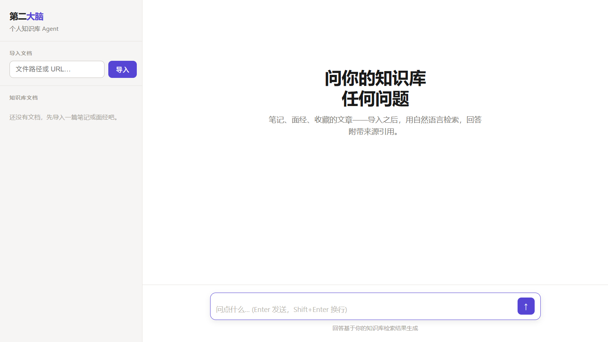
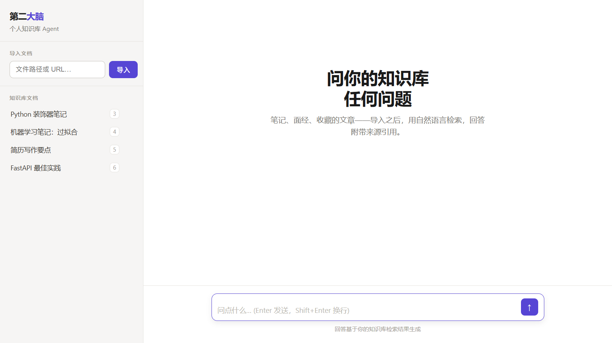

# 第二大脑 Agent

个人知识库的问答助手：导入笔记/面经/文章后，用自然语言提问，回答带来源引用。
核心卖点是工程治理四件套：**分层记忆 × 上下文治理 × Skill 化 × 评测与可观测**——
解决"知识库越用越笨"（记忆冲突污染、上下文膨胀、检索漏召回）的真实问题，
并用自建评测集 + 消融实验验证每一项的收益。




## 核心特性

- **混合检索**：向量（sqlite-vec）+ BM25 + 实体三路召回，RRF 融合；单路可切换（消融对照）
- **分层记忆**：短期（会话消息）/ 长期（memories 表）。LLM 抽取候选 → 重要性评分 → 归一化去重 → LLM 冲突检测（不覆盖旧记忆，标 conflict 并衰减置信度）→ 敏感信息过滤落库；召回按置信度注入 system 消息
- **上下文治理**：三策略独立开关 —— 工具结果清理（旧检索结果换占位符）、历史压缩（超阈值时 LLM 生成摘要）、token 预算（按优先级逐级截断）。只改发给模型的 prompt view，不动数据库
- **Skill 系统**：`skills/*/SKILL.md` 声明触发词与能力，命中后按需注入 system 提示 + 注册专用工具（渐进式披露）。内置 5 个：简历写作（含简历体检、JD 关键词缺口两个工具）、面试准备、笔记整理、学习计划、项目创意
- **可观测**：LLM/工具/skill 调用 fire-and-forget 埋点进 traces 表，按 provider 定价表估算成本；`GET /api/traces` + `GET /api/traces/summary` 成本看板
- **评测框架**：38 条中文评测集（single-hop / multi-hop / temporal / 跨会话偏好 / 对抗），8 组消融矩阵（记忆 × 压缩 × 检索方式），结果落盘含 git commit 与配置快照，一键生成 Markdown 报告

## 技术栈

Python 3.12 · FastAPI（SSE 流式）· SQLite + sqlite-vec · rank-bm25 · 原生 HTML/JS 单文件前端 · OpenAI 兼容 + Anthropic 双协议 LLM 接入

## 快速开始

```bash
# 环境：Python >= 3.12
pip install -e .

# 配置：复制样例并填入 LLM 与 embedding 的 key
cp .env.example .env

# 启动（前端与 API 同端口）
python -m uvicorn app.main:app --port 8765
# 打开 http://localhost:8765

# 桌面端：原生窗口 + 系统托盘（点 X 最小化到托盘，托盘菜单退出）
python -m app.desktop

# 打包成独立 exe：产物在 dist\SecondBrainAgent\，双击即用
# 脚本会自动把 .env 与 data\ 带到产物旁边（首次从项目根拷贝，之后沿用产物内已有的一份，
# 所以在设置面板里改过的配置和新增的知识库不会被重新打包冲掉）
# 重新打包前请先从托盘菜单退出正在运行的实例，否则脚本会直接拒绝构建
build_desktop.bat

# 跑测试（324 条）
python -m pytest tests/ -q

# 跑评测（需配置 key；--ablation 跑 8 组消融矩阵）
python -m eval.runner
python -m eval.runner --ablation
```

LLM 后端通过 `LLM_PROVIDER=openai_compat|anthropic` 切换；OpenAI 兼容端点（DeepSeek/通义/Moonshot 等）改 `OPENAI_BASE_URL` 即可。embedding 走独立的 `EMBED_*` 配置。存储为本地 SQLite + sqlite-vec，零外部服务。

## API

| 方法 | 路径 | 说明 |
|---|---|---|
| POST | `/api/ingest` | 导入文档（文件路径或 URL） |
| GET | `/api/documents` | 文档列表 |
| DELETE | `/api/documents/{id}` | 删除文档 |
| POST | `/api/chat` | SSE 流式对话（session/text_delta/tool_start/tool_end/done/error） |
| GET | `/api/sessions/{id}/messages` | 会话历史 |
| GET | `/api/traces` | 调用明细（kind/name/时间窗过滤，分页） |
| GET | `/api/traces/summary` | 成本聚合（总计 + 按 kind/name 分组） |
| GET/POST | `/api/settings` | 模型供应商设置（密钥脱敏回显；保存写 .env 并即时生效，对应侧栏 ⚙ 面板）。`persona`（存 SQLite）与 `autostart`（Windows 注册表）不走 .env，见 `app/autostart.py` |
| POST | `/api/models` | 转发供应商 `GET /models` 给设置面板做模型名建议，附带上下文窗口长度（字段名各家不一，取不到为 null）。只读，不落库；失败返回 401/502/422 |

## 项目结构

```
app/
  main.py            FastAPI 路由与 SSE
  config.py          全部配置项（pydantic-settings）
  db.py              SQLite 连接与 schema 初始化（含 vec0 虚拟表）
  llm/               双协议适配层（OpenAI 兼容 / Anthropic），统一 Message/ToolCall 类型
  ingest/            采集管道：加载（文件/URL/PDF）→ 分块 → embedding → 入库
  retrieval/         混合检索：vector + bm25 + entity 三路，RRF 融合
  agent/runtime.py   ReAct 主循环（工具调用 ≤6 轮），SSE 事件流
  agent/context.py   上下文治理三策略
  memory/            记忆写入（抽取/去重/冲突/过滤）与召回
  skills/            Skill 加载与触发（渐进式披露）
  tracing.py         埋点与成本看板查询
skills/              5 个内置技能（SKILL.md 声明式定义）
eval/                评测框架：runner / metrics / ablation / report + 38 条评测集
web/index.html       单文件前端（Notion 风格）
tests/               324 条测试
docs/design.md       设计方案
```

## 评测

评测集 38 条（single-hop 10 / multi-hop 9 / temporal 7 / 偏好 5 / 对抗 4 / 长会话 3），
按 LoCoMo 分类设计，围绕一个虚构用户的 11 篇笔记构建。消融矩阵 8 组：

| 组 | 记忆 | 压缩 | 检索 |
|---|---|---|---|
| A | ✓ | ✓ | hybrid（基线） |
| B | ✗ | ✓ | hybrid |
| C | ✓ | ✗ | hybrid |
| D | ✓ | ✓ | vector |
| E | ✓ | ✓ | bm25 |
| F | ✗ | ✗ | vector |
| G | ✓ | ✗ | vector |
| H | ✗ | ✓ | bm25 |

指标：Hit Rate@k / MRR / Recall@k（检索）、关键词覆盖率 + 禁词判据（回答）、
记忆召回准确率（跨会话偏好）。结果含 git commit hash 与配置快照，可复现。

口径说明：样本量 38 条不足以做统计显著性检验，结论以组间相对对比为准；
每篇示例文档为单 chunk，Hit@k 随机基线偏高（详见 `eval/dataset/README.md`）；
token 数为字符估算（中文实际 token 约为估算值的 3-4 倍）。

## 文档

- 设计方案：`docs/design.md`
- 评测集说明：`eval/dataset/README.md`
- Skill 编写指南：`skills/README.md`
- 简历 bullet：`docs/resume-bullets.md`
